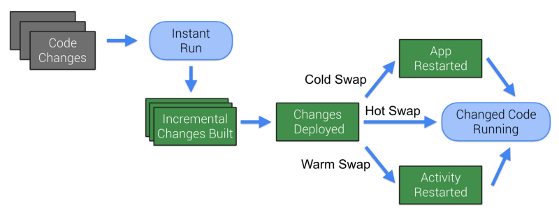

#Android Instant原理剖析

##Instant Run介绍
简单介绍一下，Instant Run是Android Studio2.0新增的一个运行机制，能显著减少第一次以后的建构和部署时间。第一次打包时全量编译,第二次及以后可以只编译修改的代码,快速应用到手机上,减少重新打包和安装的时间。

###传统编译流程
 
*修改代码 -> 完整编译 -> 部署/安装 -> 重启App -> 重启Activity* 

###Instant Run编译流程
 
*修改代码 -> 增量编译修改的代码 -> 热部署，温部署，冷部署* 

####热部署
Incremental code changes are applied and reflected in the app without needing to relaunch the app or even restart the current Activity. Can be used for most simple changes within method implementations. 
增量代码应用到app上,无需重启App和Activity,只适用方法内修改这种简单场景。

####温部署
The Activity needs to be restarted before changes can be seen and used. Typically required for changes to resources. 
Activity需要重启才生效,典型的场景是资源发生变化。

####冷部署
The app is restarted (but still not reinstalled). Required for any structural changes such as to inheritance or method signatures. 
App需要重启,但不需要重新安装。适用于代码结构和方法签名变化等场景

##参考文档
[1].[Instant Run: How Does it Work?!](https://medium.com/google-developers/instant-run-how-does-it-work-294a1633367f#.9q7cddaie) 
[2].[Android Instant Run原理分析](https://github.com/nuptboyzhb/AndroidInstantRun) 
[3].[Instant Run原理解析](http://www.jianshu.com/p/0400fb58d086) 