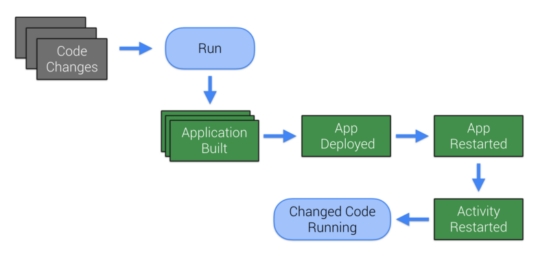

#Android Instant原理剖析

##Instant Run介绍
简单介绍一下，Instant Run是Android Studio2.0新增的一个运行机制，能显著减少第一次以后的建构和部署时间。第一次打包时全量编译,第二次及以后可以只编译修改的代码,快速应用到手机上,减少重新打包和安装的时间。

###传统编译流程
 
*修改代码 -> 完整编译 -> 部署/安装 -> 重启App -> 重启Activity* 

###Instant Run编译流程
 
*修改代码 -> 增量编译修改的代码 -> 热部署，温部署，冷部署* 

####热部署
Incremental code changes are applied and reflected in the app without needing to relaunch the app or even restart the current Activity. Can be used for most simple changes within method implementations. 
增量代码应用到app上,无需重启App和Activity,只适用方法内修改这种简单场景。

####温部署
The Activity needs to be restarted before changes can be seen and used. Typically required for changes to resources. 
Activity需要重启才生效,典型的场景是资源发生变化。

####冷部署
The app is restarted (but still not reinstalled). Required for any structural changes such as to inheritance or method signatures. 
App需要重启,但不需要重新安装。适用于代码结构和方法签名变化等场景。

##Demo分析
反编译Instant Run建构的Apk,dex文件内容如下 
 
你会看到只有com.android.build.gradle.internal.incremental和com.android.tools2个包,并没有Demo app的代码,这其实是Instant Run的框架代码,再看apk的结构,如下图 
 
发现多了一个instant-run.zip文件,再看AndroidManifest.xml 
 
看到App的Application被替换成了com.android.tools.fd.runtime.BootstrapApplication,那Demo的application在哪里呢? 继续看instant-run.zip 
 
原来demo被打包成了多个dex文件。

看到这里我们可以猜想大概的原理:
1. Instant Run框架作为一个宿主程序
2. app被编译成了多个dex文件,打包在instant-run.zip文件中。
3. app启动过程中com.android.tools.fd.runtime.BootstrapApplication动态调用instant-run中的dex文件,执行具体的业务逻辑。
恩,这和App加壳的原理很像,下面具体分析源码。

##参考文档
[1].[Instant Run: How Does it Work?!](https://medium.com/google-developers/instant-run-how-does-it-work-294a1633367f#.9q7cddaie) 
[2].[Android Instant Run原理分析](https://github.com/nuptboyzhb/AndroidInstantRun) 
[3].[Instant Run原理解析](http://www.jianshu.com/p/0400fb58d086) 