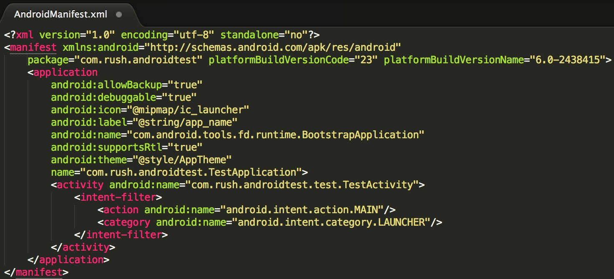

#Android Instant原理剖析

##Instant Run介绍
简单介绍一下，Instant Run是Android Studio2.0新增的一个运行机制，能显著减少第一次以后的建构和部署时间。第一次打包时全量编译,第二次及以后可以只编译修改的代码,快速应用到手机上,减少重新打包和安装的时间。

###传统编译流程
<br>
*修改代码 -> 完整编译 -> 部署/安装 -> 重启App -> 重启Activity*<br>

###Instant Run编译流程
<br>
*修改代码 -> 增量编译修改的代码 -> 热部署，温部署，冷部署*<br>

####热部署
Incremental code changes are applied and reflected in the app without needing to relaunch the app or even restart the current Activity. Can be used for most simple changes within method implementations.<br>
增量代码应用到app上,无需重启App和Activity,只适用方法内修改这种简单场景。

####温部署
The Activity needs to be restarted before changes can be seen and used. Typically required for changes to resources.<br>
Activity需要重启才生效,典型的场景是资源发生变化。

####冷部署
The app is restarted (but still not reinstalled). Required for any structural changes such as to inheritance or method signatures.<br>
App需要重启,但不需要重新安装。适用于代码结构和方法签名变化等场景。

##Demo分析
反编译Instant Run建构的Apk,dex文件内容如下<br>
<br>
你会看到只有com.android.build.gradle.internal.incremental和com.android.tools2个包,并没有demo app的代码,这其实是Instant Run的框架代码,AppInfo.class中有个applicationId,值是demo app的包名,再看apk的结构,如下图<br>
<br>
发现多了一个instant-run.zip文件,再看AndroidManifest.xml<br>
<br>
看到App的Application被替换成了com.android.tools.fd.runtime.BootstrapApplication,那app的application在哪里呢? 继续看instant-run.zip<br>
<br>
原来app被打包成了多个dex文件。

看到这里我们可以猜想大概的原理:<br>
1. Instant Run框架作为一个宿主程序<br>
2. app被编译成了多个dex文件,打包在instant-run.zip文件中。<br>
3. app启动过程中com.android.tools.fd.runtime.BootstrapApplication动态调用instant-run中的dex文件,执行具体的业务逻辑。<br>
恩,这和App加壳的原理很像,下面具体分析源码。

##Instant Run启动过程
首先看app的入口BootstrapApplication,先看attachBaseContext()

###1.　attachBaseContext()
```java
    protected void attachBaseContext(Context context) {
            // As of Marshmallow, we use APK splits and don't need to rely on
            // reflection to inject classes and resources for coldswap
            //noinspection PointlessBooleanExpression
            if (!AppInfo.usingApkSplits) {
                String apkFile = context.getApplicationInfo().sourceDir;
                long apkModified = apkFile != null ? new File(apkFile).lastModified() : 0L;
                createResources(apkModified);
                setupClassLoaders(context, context.getCacheDir().getPath(), apkModified);
            }

            createRealApplication();

            // This is called from ActivityThread#handleBindApplication() -> LoadedApk#makeApplication().
            // Application#mApplication is changed right after this call, so we cannot do the monkey
            // patching here. So just forward this method to the real Application instance.
            super.attachBaseContext(context);

            if (realApplication != null) {
                try {
                    Method attachBaseContext =
                            ContextWrapper.class.getDeclaredMethod("attachBaseContext", Context.class);
                    attachBaseContext.setAccessible(true);
                    attachBaseContext.invoke(realApplication, context);
                } catch (Exception e) {
                    throw new IllegalStateException(e);
                }
            }
    }
```

依次看createResources　->　setupClassLoaders　->　createRealApplication　->　调用real　application的attachBaseContext方法

####1.1　createResources()
```java
private void createResources(long apkModified) {
        // Look for changes stashed in the inbox folder while the server was not running
        FileManager.checkInbox();

        File file = FileManager.getExternalResourceFile();
        externalResourcePath = file != null ? file.getPath() : null;

        if (Log.isLoggable(LOG_TAG, Log.VERBOSE)) {
            Log.v(LOG_TAG, "Resource override is " + externalResourcePath);
        }

        if (file != null) {
            try {
                long resourceModified = file.lastModified();
                if (Log.isLoggable(LOG_TAG, Log.VERBOSE)) {
                    Log.v(LOG_TAG, "Resource patch last modified: " + resourceModified);
                    Log.v(LOG_TAG, "APK last modified: " + apkModified + " " +
                            (apkModified > resourceModified ? ">" : "<") + " resource patch");
                }

                if (apkModified == 0L || resourceModified <= apkModified) {
                    if (Log.isLoggable(LOG_TAG, Log.VERBOSE)) {
                        Log.v(LOG_TAG, "Ignoring resource file, older than APK");
                    }
                    externalResourcePath = null;
                }
            } catch (Throwable t) {
                Log.e(LOG_TAG, "Failed to check patch timestamps", t);
            }
        }
    }
```
该方法主要判断外部资源有没有更新,并把路径存储在externalResourcePath变量上。

####1.2　setupClassLoaders()
```java
private static void setupClassLoaders(Context context, String codeCacheDir, long apkModified) {
        List<String> dexList = FileManager.getDexList(context, apkModified);

        // Make sure class loader finds these
        @SuppressWarnings("unused") Class<Server> server = Server.class;
        @SuppressWarnings("unused") Class<MonkeyPatcher> patcher = MonkeyPatcher.class;

        if (!dexList.isEmpty()) {
            if (Log.isLoggable(LOG_TAG, Log.VERBOSE)) {
                Log.v(LOG_TAG, "Bootstrapping class loader with dex list " + join('\n', dexList));
            }

            ClassLoader classLoader = BootstrapApplication.class.getClassLoader();
            String nativeLibraryPath;
            try {
                nativeLibraryPath = (String) classLoader.getClass().getMethod("getLdLibraryPath")
                                .invoke(classLoader);
                if (Log.isLoggable(LOG_TAG, Log.VERBOSE)) {
                    Log.v(LOG_TAG, "Native library path: " + nativeLibraryPath);
                }
            } catch (Throwable t) {
                Log.e(LOG_TAG, "Failed to determine native library path " + t.getMessage());
                nativeLibraryPath = FileManager.getNativeLibraryFolder().getPath();
            }
            IncrementalClassLoader.inject(
                    classLoader,
                    nativeLibraryPath,
                    codeCacheDir,
                    dexList);
        } else {
            Log.w(LOG_TAG, "No instant run dex files added to classpath");
        }
    }
```
调用了IncrementalClassLoader#inject()方法,IncrementalClassLoader源码如下:
```java
/**
 * A class loader that loads classes from any .dex file in a particular directory on the SD card.
 * <p>
 * <p>Used to implement incremental deployment to Android phones.
 */
public class IncrementalClassLoader extends ClassLoader {
    /** When false, compiled out of runtime library */
    public static final boolean DEBUG_CLASS_LOADING = false;

    private final DelegateClassLoader delegateClassLoader;

    public IncrementalClassLoader(
            ClassLoader original, String nativeLibraryPath, String codeCacheDir, List<String> dexes) {
        super(original.getParent());

        // TODO(bazel-team): For some mysterious reason, we need to use two class loaders so that
        // everything works correctly. Investigate why that is the case so that the code can be
        // simplified.
        delegateClassLoader = createDelegateClassLoader(nativeLibraryPath, codeCacheDir, dexes,
                original);
    }

    @Override
    public Class<?> findClass(String className) throws ClassNotFoundException {
        try {
            Class<?> aClass = delegateClassLoader.findClass(className);
            //noinspection PointlessBooleanExpression,ConstantConditions
            if (DEBUG_CLASS_LOADING && Log.isLoggable(LOG_TAG, Log.VERBOSE)) {
                Log.v(LOG_TAG, "Incremental class loader: findClass(" + className + ") = " + aClass);
            }

            return aClass;
        } catch (ClassNotFoundException e) {
            //noinspection PointlessBooleanExpression,ConstantConditions
            if (DEBUG_CLASS_LOADING && Log.isLoggable(LOG_TAG, Log.VERBOSE)) {
                Log.v(LOG_TAG, "Incremental class loader: findClass(" + className + ") : not found");
            }
            throw e;
        }
    }

    /**
     * A class loader whose only purpose is to make {@code findClass()} public.
     */
    private static class DelegateClassLoader extends BaseDexClassLoader {
        private DelegateClassLoader(
                String dexPath, File optimizedDirectory, String libraryPath, ClassLoader parent) {
            super(dexPath, optimizedDirectory, libraryPath, parent);
        }

        @Override
        public Class<?> findClass(String name) throws ClassNotFoundException {
            try {
                Class<?> aClass = super.findClass(name);
                //noinspection PointlessBooleanExpression,ConstantConditions
                if (DEBUG_CLASS_LOADING && Log.isLoggable(LOG_TAG, Log.VERBOSE)) {
                    Log.v(LOG_TAG, "Delegate class loader: findClass(" + name + ") = " + aClass);
                }

                return aClass;
            } catch (ClassNotFoundException e) {
                //noinspection PointlessBooleanExpression,ConstantConditions
                if (DEBUG_CLASS_LOADING && Log.isLoggable(LOG_TAG, Log.VERBOSE)) {
                    Log.v(LOG_TAG, "Delegate class loader: findClass(" + name + ") : not found");
                }
                throw e;
            }
        }
    }

    private static DelegateClassLoader createDelegateClassLoader(
            String nativeLibraryPath, String codeCacheDir, List<String> dexes,
            ClassLoader original) {
        String pathBuilder = createDexPath(dexes);
        return new DelegateClassLoader(pathBuilder, new File(codeCacheDir),
                nativeLibraryPath, original);
    }

    @NonNull
    private static String createDexPath(List<String> dexes) {
        StringBuilder pathBuilder = new StringBuilder();
        boolean first = true;
        for (String dex : dexes) {
            if (first) {
                first = false;
            } else {
                pathBuilder.append(File.pathSeparator);
            }

            pathBuilder.append(dex);
        }

        if (Log.isLoggable(LOG_TAG, Log.VERBOSE)) {
            Log.v(LOG_TAG, "Incremental dex path is "
                    + BootstrapApplication.join('\n', dexes));
        }
        return pathBuilder.toString();
    }

    private static void setParent(ClassLoader classLoader, ClassLoader newParent) {
        try {
            Field parent = ClassLoader.class.getDeclaredField("parent");
            parent.setAccessible(true);
            parent.set(classLoader, newParent);
        } catch (IllegalArgumentException e) {
            throw new RuntimeException(e);
        } catch (IllegalAccessException e) {
            throw new RuntimeException(e);
        } catch (NoSuchFieldException e) {
            throw new RuntimeException(e);
        }
    }

    public static ClassLoader inject(
            ClassLoader classLoader, String nativeLibraryPath, String codeCacheDir,
            List<String> dexes) {
        IncrementalClassLoader incrementalClassLoader =
                new IncrementalClassLoader(classLoader, nativeLibraryPath, codeCacheDir, dexes);
        setParent(classLoader, incrementalClassLoader);

        return incrementalClassLoader;
    }
}
```
这里需要先介绍一下ClassLoader的双亲委派模型(Parent Delegation Model),其工作过程是这样的:<br>
如果一个类加载器收到了类加载的请求,它首先不会自己去尝试加载这个类,优先委派给父加载器去加载,每一层都向上委派,直到顶层的类加载器(在Android里是BootClassLoader),只有当父类无法完成加载时,子类才会尝试去加载。<br>
App的类加载器是PathClassLoader,其父加载器为BootClassLoader,Instant　Run通过反射改变PathClassLoader的父加载器,达到inject的方式,inject前后结构如下图所示:<br>
<br>

####1.3　createRealApplication()


####1.4　real　application的attachBaseContext方法

##参考文档
[1].[Instant Run: How Does it Work?!](https://medium.com/google-developers/instant-run-how-does-it-work-294a1633367f#.9q7cddaie)<br>
[2].[Android Instant Run原理分析](https://github.com/nuptboyzhb/AndroidInstantRun)<br>
[3].[Instant Run原理解析](http://www.jianshu.com/p/0400fb58d086)<br>